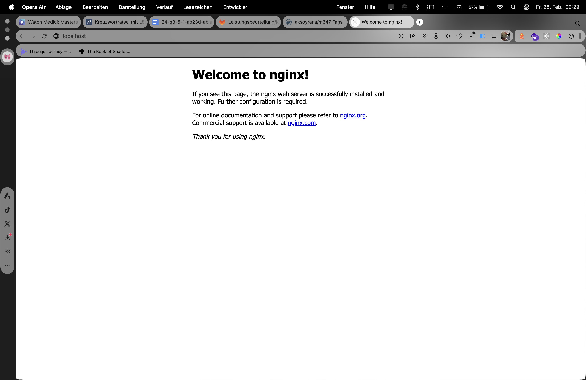
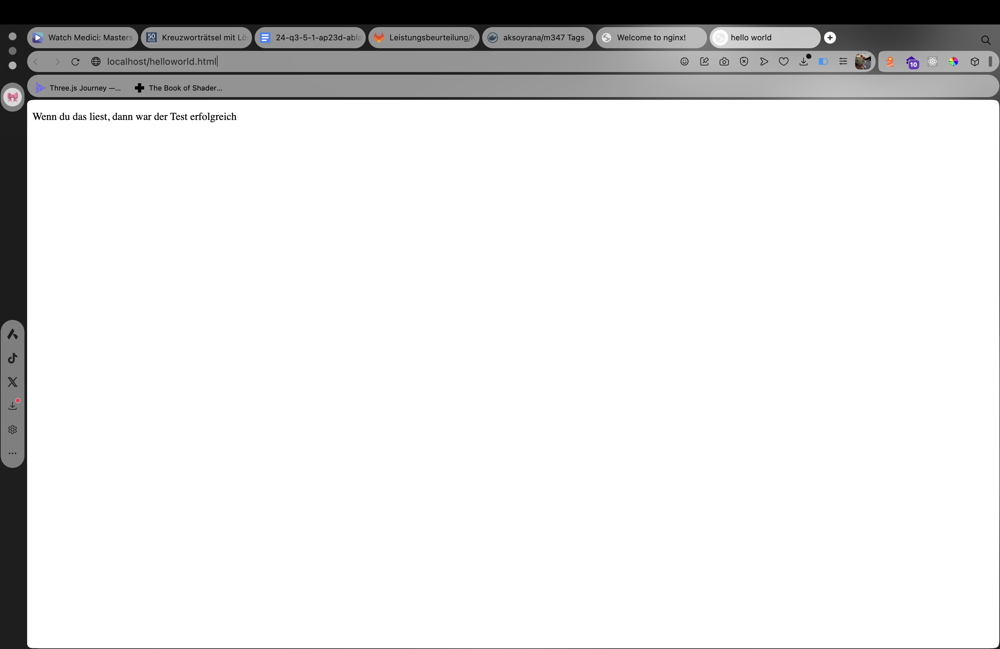
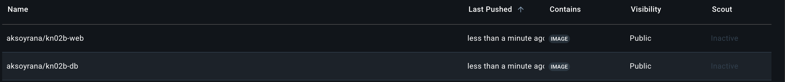
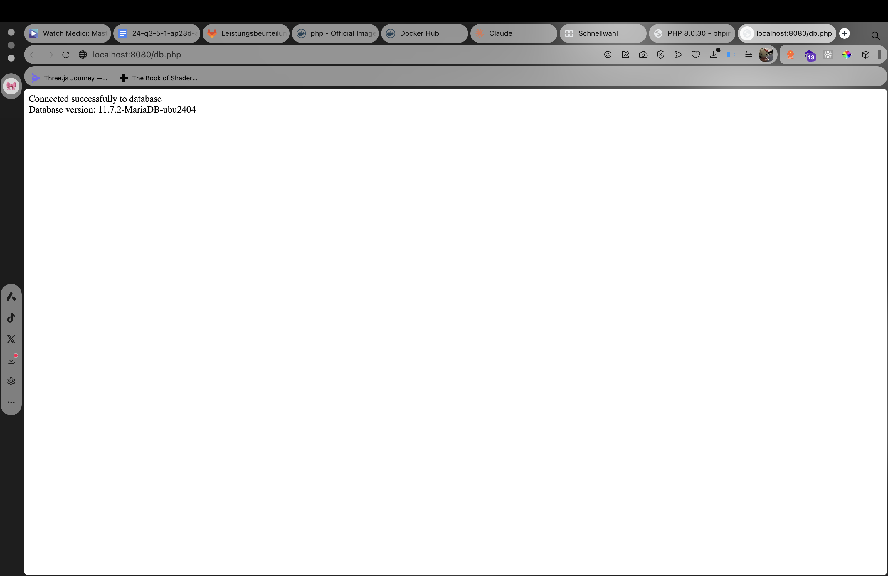
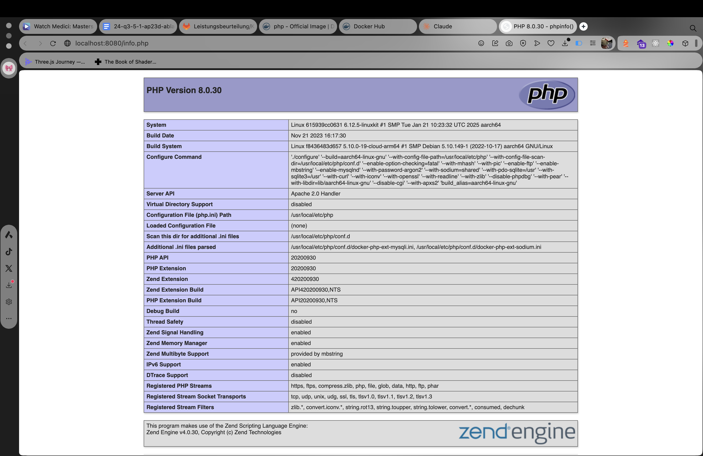

# KN02
 
## Teil A: Dockerfile I
 
```sh
docker build -t <username>/kn02a:latest .
docker run -d -p 80:80 --name kn02a <username>/kn02a:latest
docker push <username>/kn02a:latest
```




# Docker-Konfiguration für PHP/MySQL-Webanwendung

Dieses Repository enthält Dockerfiles für eine einfache PHP-Webanwendung mit MariaDB-Datenbankanbindung. Es umfasst zwei Hauptkomponenten:
1. Einen MariaDB-Datenbankserver
2. Einen PHP/Apache-Webserver

## Dateien

- `info.php`: Zeigt PHP-Konfigurationsinformationen an
- `db.php`: Testet die Datenbankverbindung
- `helloworld.html`: Einfache HTML-Testseite

## Dockerfile für MariaDB (kn02b-db)

```dockerfile
FROM mariadb

# Setzt die Umgebungsvariablen für Benutzername und Passwort
ENV MYSQL_ROOT_PASSWORD=password
ENV MYSQL_DATABASE=mydatabase
ENV MYSQL_USER=user
ENV MYSQL_PASSWORD=password

# Exponiert den Standard MySQL Port
EXPOSE 3306
```

## Teil B: Dockerfile II für PHP/Apache (kn02b-web)

```dockerfile
FROM php:8.0-apache

# Setzt das Arbeitsverzeichnis
WORKDIR /var/www/html

# Kopiert PHP-Dateien in das Arbeitsverzeichnis
COPY info.php .
COPY db.php .

# Installiert das MySQLi-Modul
RUN docker-php-ext-install mysqli

# Exponiert den Apache HTTP-Port
EXPOSE 80
```

## Docker-Befehle
```
docker build -t <username>/kn02b-db:latest -f Dockerfile.db .
```

```
docker run -d -p 3306:3306 --name kn02b-db <username>/kn02b-db:latest
```

```
docker build -t <username>/kn02b-web:latest -f Dockerfile.web .
```

```
docker run -d -p 8080:80 --name kn02b-web --link kn02b-db <username>/kn02b-web:latest
```



## Testen der Installation

1. Öffne im Browser `http://localhost:8080/info.php` um die PHP-Konfiguration zu überprüfen

2. Öffne im Browser `http://localhost:8080/db.php` um die Datenbankverbindung zu testen


